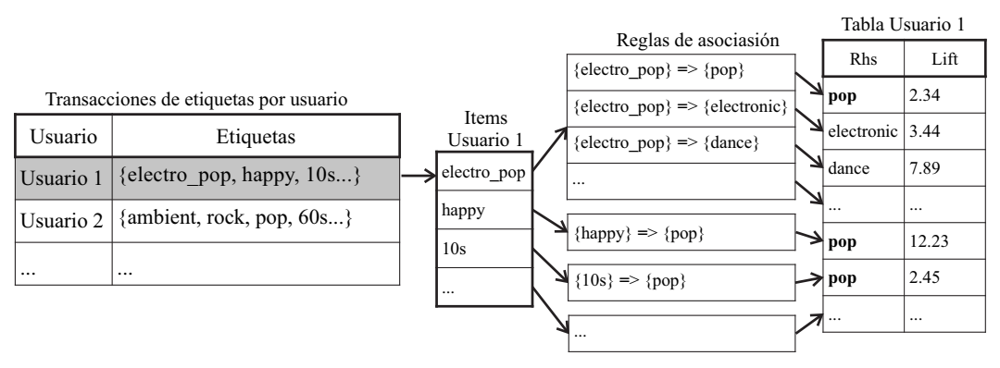
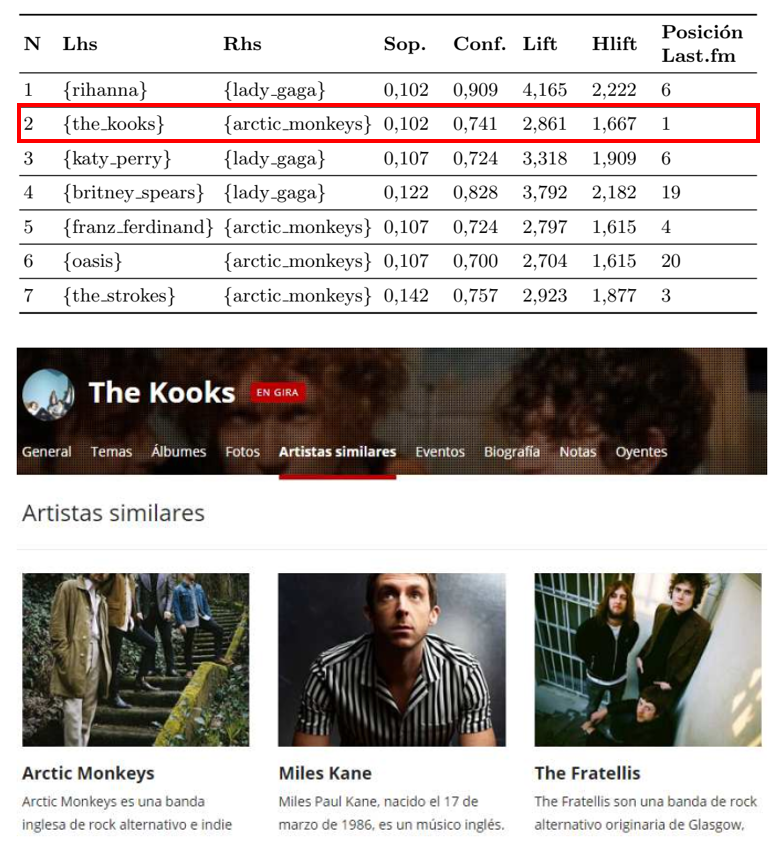

# Sistema de Recomendación de Artistas Musicales

El proyecto propone un sistema de recomendación de artistas musicales basado en los hábitos de escucha de la comunidad de Last.fm empleando técnicas de minería de datos mediante el descubrimiento de reglas de asociación. Se eligió al método de filtrado colaborativo como eje del sistema propuesto. 

En primer lugar, se establecieron grupos de usuarios con gustos de música similares sobre el conjunto de datos estudiado a través de un proceso de iteración que correlacionó las etiquetas que describían a los artistas escuchados con las que colocó cada usuario. Luego, en los clústeres se buscaron reglas de asociación que permitieron descubrir nuevos artistas para recomendar entre los integrantes del grupo. 

Los resultados se compararon con el sistema recomendador de la plataforma Last.fm y se concluyó que fueron satisfactorios cuando se trabaja con usuarios frecuentes del servicio.

El proyecto se divide en dos etapas, en la primera (*1_exploracion_limpieza.Rmd*) se hace un análisis exploratorio y una limpieza de los datos públicos recopilados de la API de Last.fm. En la segunda (*2_metodologia.Rmd*) se aplican sobre los datos curados reglas de asociación para generar las recomendaciones.

Para conocer más detalles del trabajo se puede consultar el siguiente documento: [Paper](documentacion/Paper.pdf).